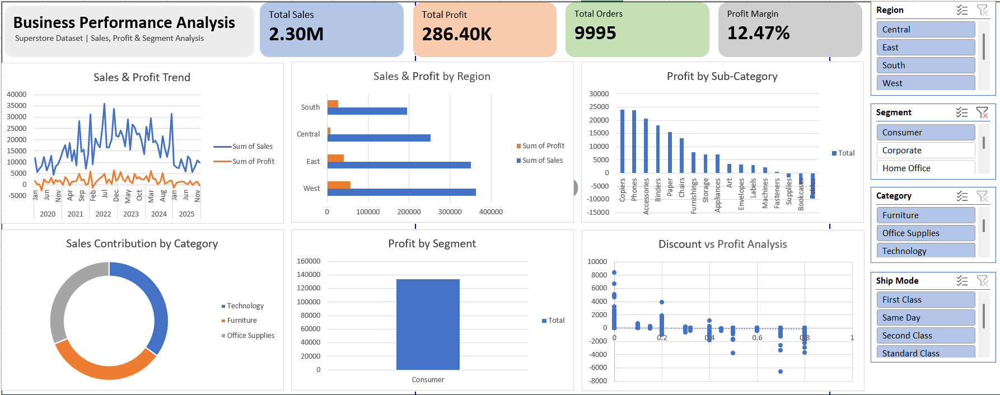

<div align="center">

# 📊 Business Performance Analysis Dashboard

### *Executive-Level Business Intelligence & Analytics*


</div>

---

## 📌 Project Overview

This project focuses on analyzing **overall business performance** using the **Superstore dataset**. The goal was to evaluate revenue, profitability, customer segments, regional performance, and the impact of discount strategies through an **interactive Excel dashboard**.

> 💼 The dashboard is designed to simulate an **executive-level business reporting tool** for strategic decision-making.

---

## 🎯 Objectives

<table>
<tr>
<td width="50%">

✅ Monitor overall sales and profit performance

✅ Identify high-performing and underperforming regions

✅ Evaluate profitability at product and segment levels

</td>
<td width="50%">

✅ Analyze the impact of discounting on profit margins

✅ Enable dynamic filtering for decision-making support

✅ Provide actionable insights for business growth

</td>
</tr>
</table>

---

## 📈 Key Performance Indicators (KPIs)

<div align="center">

| Metric | Value |
|:------:|:-----:|
| 💰 **Total Sales** | ₹2.30M |
| 📊 **Total Profit** | ₹286K |
| 🛒 **Total Orders** | 9,995 |
| 📉 **Profit Margin** | 12.47% |

</div>

---

## 🔍 Analysis Performed

### 1️⃣ Sales & Profit Trend Analysis
- Evaluated **time-based performance** to understand revenue growth patterns and seasonal fluctuations.

### 2️⃣ Regional Performance Analysis
- Compared sales and profit across regions to identify **revenue-driving** and **underperforming markets**.

### 3️⃣ Product-Level Profitability
- Analyzed sub-category performance to detect **profit-driving products** and **loss-making items**.

### 4️⃣ Segment-Level Evaluation
- Assessed **Consumer**, **Corporate**, and **Home Office** segments to determine contribution to profitability.

### 5️⃣ Discount vs Profit Relationship
- Performed correlation-style analysis to examine how **higher discount levels impact profitability**.

---

## 🛠 Tools & Techniques Used

<div align="center">

| Tool/Technique | Purpose |
|----------------|---------|
| 📗 **Microsoft Excel** | Primary analysis and dashboard creation |
| 📊 **Pivot Tables** | Data summarization and aggregation |
| 🎛 **Slicers** | Interactive filtering functionality |
| 📌 **KPI Cards** | Executive-level metric visualization |
| 📈 **Scatter Plots** | Discount vs Profit correlation analysis |
| 🎨 **Custom Formatting** | Professional number formatting (M, K, %) |

</div>

---

## 📊 Dashboard Features

```
✨ Interactive Filtering
   ├── Region
   ├── Segment
   ├── Category
   └── Ship Mode

🎯 Executive-Style KPI Cards

📐 Structured Layout for Business Storytelling

🎨 Clean and Minimal Design for Decision Support

🔄 Real-time Data Refresh Capability
```

---

## 💡 Key Business Insights

<details>
<summary>🌍 <b>Regional Performance</b></summary>
<br>
The <b>West region</b> generated the highest revenue and profit contribution, indicating strong market presence and customer engagement.
</details>

<details>
<summary>💻 <b>Category Analysis</b></summary>
<br>
<b>Technology category</b> contributed the largest share of overall sales, representing a key revenue driver for the business.
</details>

<details>
<summary>🏷 <b>Discount Impact</b></summary>
<br>
Higher discount levels <b>negatively impacted profitability</b> in several cases, suggesting the need for refined pricing strategies.
</details>

<details>
<summary>📦 <b>Product Performance</b></summary>
<br>
Certain sub-categories showed <b>strong sales but lower margins</b>, highlighting opportunities for cost optimization.
</details>

---

## 🖼 Dashboard Preview

<div align="center">

)

*Interactive Excel Dashboard showcasing KPIs, trends, and regional performance*

</div>

---

## 🚀 Project Outcome

This dashboard demonstrates:

- ✅ **Practical business analysis skills**
- ✅ **Data visualization techniques**
- ✅ **Ability to translate raw data into actionable insights**
- ✅ **Executive-level reporting capabilities**
- ✅ **Proficiency in Excel-based analytics**

---

## 📂 Project Structure

```
📦 Business-Performance-Dashboard
 ┣ 📊 Superstore_Dataset.xlsx
 ┣ 📈 Dashboard.xlsx
 ┣ 📷 dashboard_preview.png
 ┗ 📄 README.md
```

---

## 🔗 Connect With Me

<div align="center">

[](https://github.com/detactivepritam)
[](https://linkedin.com/in/yourprofile)
[](https://yourportfolio.com)

</div>

---

<div align="center">

### ⭐ If you found this project helpful, please consider giving it a star!

**Made with ❤️ by [detactivepritam](https://github.com/detactivepritam)**

</div>
